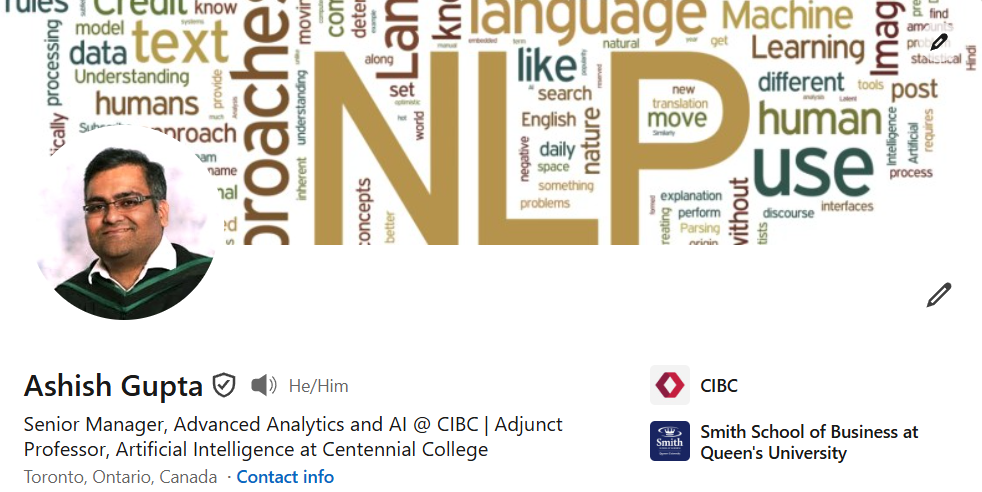

 

 

 

A seasoned analytics leader with over 14 years of experience in Banking and Financial Services. I lead initiatives that leverage ML and NLP solutions to drive real business impact. I work best at the intersection of data science and business strategy — turning complex problems into clear, actionable direction for senior stakeholders.

In addition to my corporate role, I hold position as a Professor of Artificial Intelligence at Centennial College. I am dedicated to imparting knowledge and nurturing the next generation of AI and ML professionals. I am dedicated to imparting knowledge and nurturing the next generation of AI and ML professionals.

 

  

 

<h3 align="center">Statistics</h3>
  

 
<h3 align="center">Highlights</h3>

 

 

